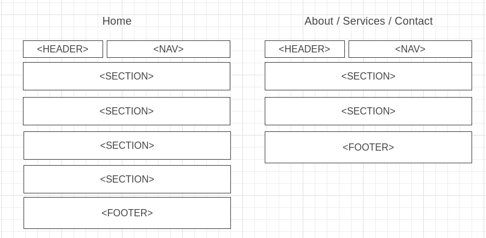

# Development Strategy

> `Apptheme Homepage`

This page contains basic information about the company which provides basic web-design services.

## Wireframe

## 0. Set-Up

__A User can see my initial repository and live demo__

### Repo

- Generate from Template
- Write initial, basic README
- Turn on GitHub Pages

## 1. User Story: Header and navigation bar

__As a site visitor, I want to know what the webpage is called and see the links within the site__

### Branches

1. This user story was developed on a brach called `1-header-nav`
1. It was merged to `master` when the feature was finished.

### HTML

- header and nav elements 
- flexbox grid template

### CSS

- row of links
- green tone on current page name

---

## 2. User Story: Showcase

__As a site visitor,  I want to learn about the purpose of the website.__

### Branches

1. This user story was developed on a brach called `2-showcase`
1. It was merged to `master` when the feature was finished.

### HTML

- section with an `<h1>` tag and a paragraph.
- flexbox grid template

### CSS

- Transparent, grey box with rounded edges
- background image

---

## 3. User Story: Features

__As a site visitor, I want to learn about the basic services provided by the company.__

### Branches

1. This user story was developed on a brach called `3-features`
1. It was merged to `master` when the feature was finished.

### HTML

- section with six `<h4>` tags in two rows
- flexbox grid template

### CSS

- font-awesome icons
- centered green icons
- white text

---

## 4. User Story: Info section

__As a site visitor, I want to learn about the basic services provided by the company.__

### Branches

1. This user story was developed on a brach called `4-info-section`
1. It was merged to `master` when the feature was finished.

### HTML

- section element with unordered list
- flexbox grid template

### CSS

- grey background image

---

## 5. User Story: Company information

__As a site visitor, I want to know basic information about the company.__

### Branches

1. This user story was developed on a brach called `5-company-info`
1. It was merged to `master` when the feature was finished.

### HTML

- Section element with three `<h4>` tags and a form

### CSS

- font-awesome icons
- grey background
- white text

---

## 6. User Story: Footer

__As a site visitor, I want to read copyright information about this web page__

### Branches

1. This user story was developed on a brach called `6-footer`
1. It was merged to `master` when the feature was finished.

### HTML

- footer element
- copyright information

### CSS

- Green background
- white text

---

## 7. User Story: About page

__As a site visitor, I want to get the basic information about company__

### Branches

1. This user story was developed on a brach called `7-about-page`
1. It was merged to `master` when the feature was finished.

### HTML

- section element with two `<h2>` tags and paragraphs.

### CSS

- common css rules applies here

---

## 8. User Story: Services page

__As a site visitor, I want to learn about services provided__

### Branches

1. This user story was developed on a brach called `8-services-page`
1. It was merged to `master` when the feature was finished.

### HTML

- section element with one `<h2>` and three `<h3>` tags followed by paragraphs

### CSS

-alternating background colors for each part

---

## 9. User Story: Contact page

__As a site visitor, I want to be able to send a message to the company__

### Branches

1. This user story was developed on a brach called `9-contact-page`
1. It was merged to `master` when the feature was finished.

### HTML

- section element with embedded form.

### CSS

- Grey background
- white text

---

## Finishing Touches

- Write final, complete README
 
- Validate code to check for any last mistakes